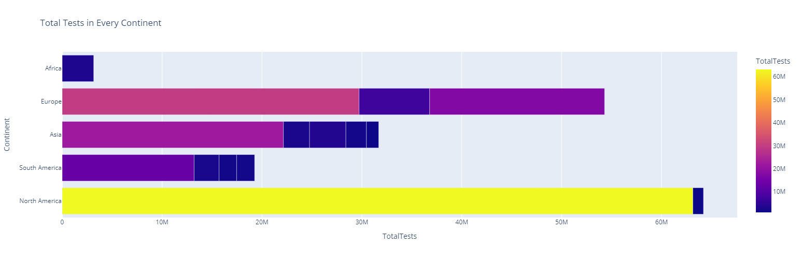
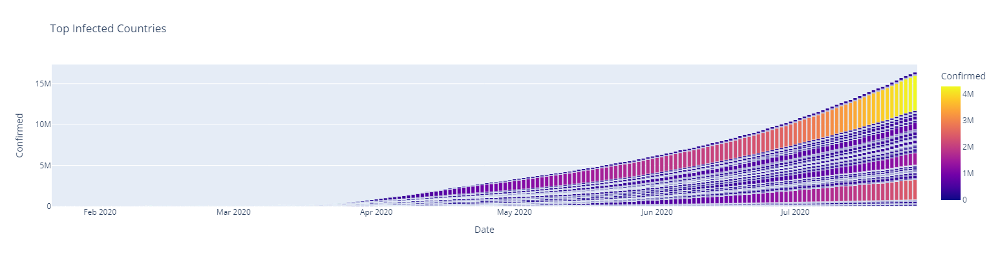
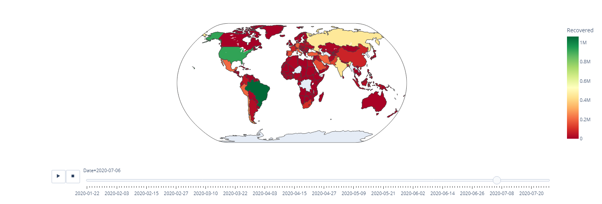
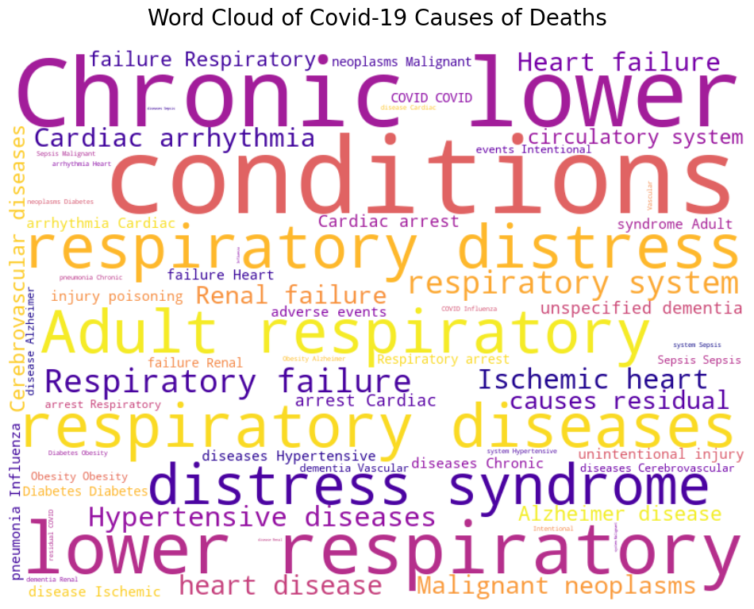

# COVID-19 Data Analysis and Visualization

**Author:** Umar Khairur Rahman

---

## Table of Contents
- [COVID-19 Data Analysis and Visualization](#covid-19-data-analysis-and-visualization)
  - [Table of Contents](#table-of-contents)
  - [Project Overview](#project-overview)
  - [Key Features](#key-features)
  - [Dataset](#dataset)
  - [Technologies Used](#technologies-used)
  - [Prerequisites](#prerequisites)
  - [Installation \& Usage](#installation--usage)
  - [Visualizations](#visualizations)
  - [Contact](#contact)

---

## Project Overview

This project provides an in-depth analysis and visualization of COVID-19 data, with a specific focus on understanding the primary causes of death and associated patient condition groups. Utilizing Python and various data science libraries, this Jupyter Notebook explores patterns and presents insights into the factors contributing to COVID-19 mortality. The goal is to offer a clear, data-driven perspective on the pandemic's impact through comprehensive analysis and compelling visual storytelling.

---

## Key Features

* **Data Cleaning and Preparation:** (Implicit, as it's a standard step for analysis) Processing raw data for analysis.
* **Exploratory Data Analysis (EDA):** Investigating the dataset to uncover patterns, anomalies, and insights regarding COVID-19 mortality.
* **Cause of Death Analysis:** Identifying and visualizing the most prevalent conditions and condition groups leading to death in COVID-19 patients.
* **Interactive Visualizations:** Leveraging libraries like Plotly for dynamic charts (if applicable beyond setup).
* **Insightful Word Clouds:** Generating word clouds to intuitively display the frequency and prominence of specific medical conditions and groups.

---

## Dataset

The analysis presented in this notebook is based on a dataset containing information related to COVID-19 cases. This includes (but may not be limited to) patient conditions, condition groups, and reported causes of death.

---

## Technologies Used

* **Python 3.x**
* **Jupyter Notebook**
* **Libraries:**
    * `pandas`: For data manipulation and analysis.
    * `numpy`: For numerical operations.
    * `matplotlib`: For static, animated, and interactive visualizations.
    * `plotly`: For interactive and publication-quality graphs (plotly.js setup was noted in the notebook).
    * `wordcloud`: For generating word cloud images.

---

## Prerequisites

Before running the notebook, ensure you have the following installed:
* Python 3.7 or higher.
* Jupyter Notebook or JupyterLab.
* The Python libraries listed under [Technologies Used](#technologies-used).

---

## Installation & Usage

1.  **Clone the repository:**
    ```bash
    git clone [https://github.com/your-username/your-repository-name.git](https://github.com/your-username/your-repository-name.git)
    cd your-repository-name
    ```
2.  **Create a virtual environment (recommended):**
    ```bash
    python -m venv venv
    source venv/bin/activate  # On Windows use `venv\Scripts\activate`
    ```
3.  **Install the required libraries:**
    It's good practice to include a `requirements.txt` file in your repository. You can create one using:
    ```bash
    pip freeze > requirements.txt
    ```
    Then, users can install dependencies using:
    ```bash
    pip install -r requirements.txt
    ```
    If you don't have a `requirements.txt`, list the manual pip install commands:
    ```bash
    pip install pandas numpy matplotlib plotly wordcloud
    ```
4.  **Launch Jupyter Notebook or JupyterLab:**
    ```bash
    jupyter notebook
    ```
    or
    ```bash
    jupyter lab
    ```
5.  **Open and run the `Covid 19.ipynb` notebook.**

---

## Visualizations

This project features several visualizations to illustrate the findings:

* 
* 
* 
* 

---

## Contact

**Umar Khairur Rahman**
* GitHub: `https://github.com/FBNajis` 
* Email: `umarkhairur@gmail.com` 
* LinkedIn: `https://www.linkedin.com/in/umar-khairur-rahman-168739258/`

Project Link: `https://github.com/FBNajis/Covid-19-Analysis-and-Visualization`

---
